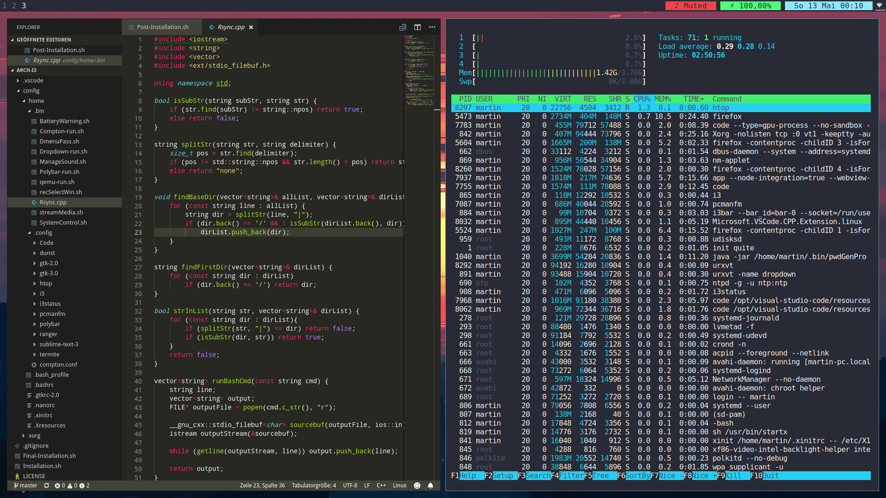

# arch-setup

Arch linux automate setup with:
- i3wm
- full disk encryption
- without lvm
- systemd boot
- firewall
- android support
- ssd & notebook optimized

# Prerequisites:
- booting arch installation medium
- a working internet connection
	
# How-To:
    - wget https://bit.ly/2skPLep -O - | tar xz
    - cd arch-setup-master
    - chmod +x *.sh
    - ./Pre-Installation.sh

# Default theme:

# Transparent theme:

## License
This Project is released under GNU GPLv3 licence. Copyright (c) iPUSH (Martin Muenning).